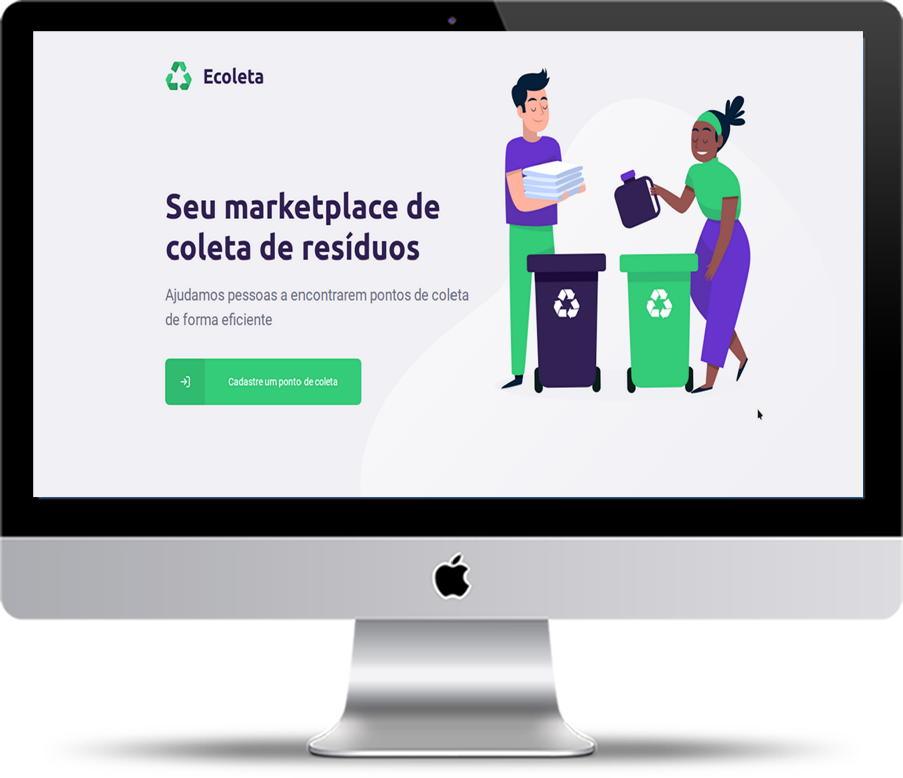
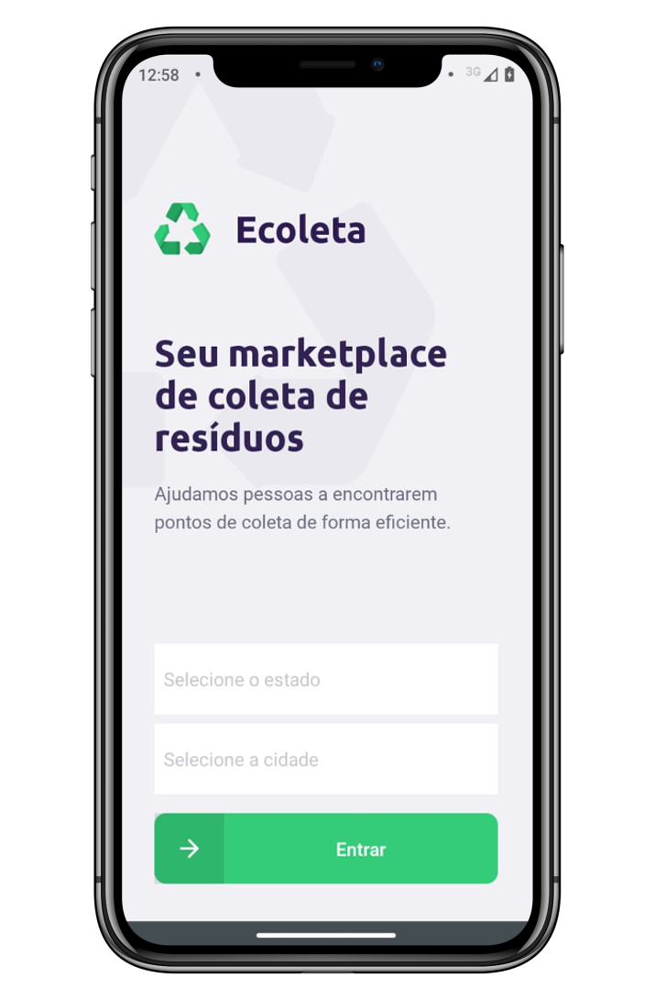

<h4></h4>
<h4 align="center">
    
         
        <b>Your waste collection marketplace </b>
    </img>
     
     
    
    <h4></h4>
    <h2>Next Level Week</h1>
    <h4>Project created in next level week</h3>
</h4>

 
 

## 🚀 Used Technologies
<ul>
    All
    <ul>
        <li>
            <a href="https://nodejs.org/en/">Node.JS</a>
        </li>
        <li>
            <a href="https://www.typescriptlang.org/">Typescript</a>   
        </li>
    </ul>
    Frontend
    <ul>
        <li>
            <a href="https://reactjs.org/">React</a> 
        </li>
    </ul>
    Backend
    <ul>
        <li>
            <a href="https://expressjs.com/">Express</a>
        </li>
    </ul>
    Mobile
    <ul>
        <li>
            <a href="https://expo.io/">Expo</a> 
        </li>
        <li>
            <a href="https://reactnative.dev/">React Native</a> 
        </li>
    </ul>
</ul>

 
 
 

    <h2>Preview</h2>
    

        
        
    

 
 
 

## 🎓 Instructor
[Diego Fernandes](https://github.com/diego3g), [Rocketseat](https://github/rocketseat) CEO was the leader of Next Level Week

 
 

## LICENSE
This project is under [MIT license](LICENSE)
